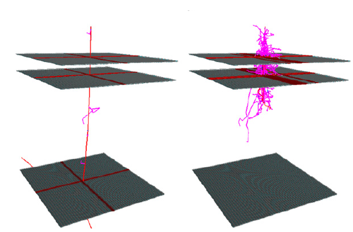

<p align="left">
  
</p>

# G4MuonCounterSimulator
A software tool to simulate and reconstruct events in a muon detector telescope (e.g. Auger BATATA) using GEANT4 + AugerOffline. It is distributed for research use only under the GNU General Public License v3.0.

## **Credits**
If you use this software for your research, please acknowledge it in your papers by citing the following references:

* `S. Riggi et al., "Reconstruction of muon tracks in a buried plastic scintillator muon telescope (BATATA)", Nucl. Instr. and Meth. A 688 (2012) 22–31`

or consider including me (`S. Riggi, INAF - Osservatorio Astrofisico di Catania, Via S. Sofia 78, I-95123, Catania, Italy`)
as a co-author on your publications.

## **Status**
Software is no longer maintained.

## **Installation**  

### **Prerequisites**
Install the project mandatory dependencies:  
* ROOT [https://root.cern.ch/]
* GEANT4 [https://www.r-project.org/]
* AugerOffline (and relative dependencies)

Make sure you have set the following environment variables to the external library installation dirs 
* ROOTSYS: set to ROOT installation path
* AUGEROFFLINEROOT: set to AugerOffline installation path

NB: Modify Makefile CPPFLAGS and LDFLAGS in case the dependency tools cannot be found.

### **Build**
To build the project:

* Clone this repository into your local $SOURCE_DIR    
  ```git clone https://github.com/simoneriggi/mida-imputation.git $SOURCE_DIR```    
* In the project directory type:    
  ```make```  

Binaries will be placed in the bin/ directory and libraries in the lib/ directory.

### **Usage**
* ```MDImputation [--input=[path-to-inputfile]] [--config=[path-to-configfile]]```    
&nbsp;&nbsp;&nbsp;&nbsp;&nbsp;&nbsp;&nbsp;```--input=[path-to-inputfile] -  Input data file (.dat) with missing data to be imputed```   
&nbsp;&nbsp;&nbsp;&nbsp;&nbsp;&nbsp;&nbsp;```--input=[path-to-inputfile] -  Input data file (.dat) with missing data to be imputed```   
&nbsp;&nbsp;&nbsp;&nbsp;&nbsp;&nbsp;&nbsp;```--method=[imputation-method] -  Imputation method to be used (1=MEAN, 2=LISTWISE DELETION, 3=MultipleImputation, 4=MN clustering, 5=MSN clustering```   
&nbsp;&nbsp;&nbsp;&nbsp;&nbsp;&nbsp;&nbsp;```--config=[path-to-configfile] - Configuration file name with options```    
